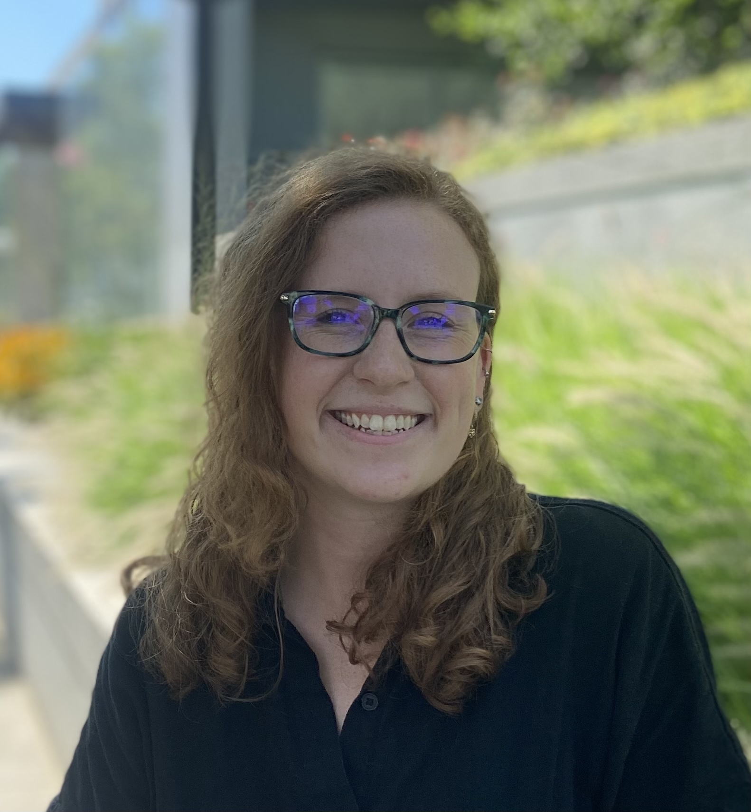

 I am a Ph.D. student at the University of California, Berkeley in Agricultural and Resource Economics. My research interests are in environmental economics and industrial organization. More specifically, I am interested in the relationship between environmental policy, individuals' economic outcomes, and firm behavior, particularly in the context of the ongoing clean energy transition. Before coming to UC Berkeley, I earned my B.S. in economics at George Mason University and worked for three years at the Federal Reserve Board of Governors. 

When I am not working on research, I enjoy reading fiction, cheering for Philadelphia sports teams, and hiking. 

You can reach me at molly (underscore) harnish (at) berkeley (dot) edu. 
